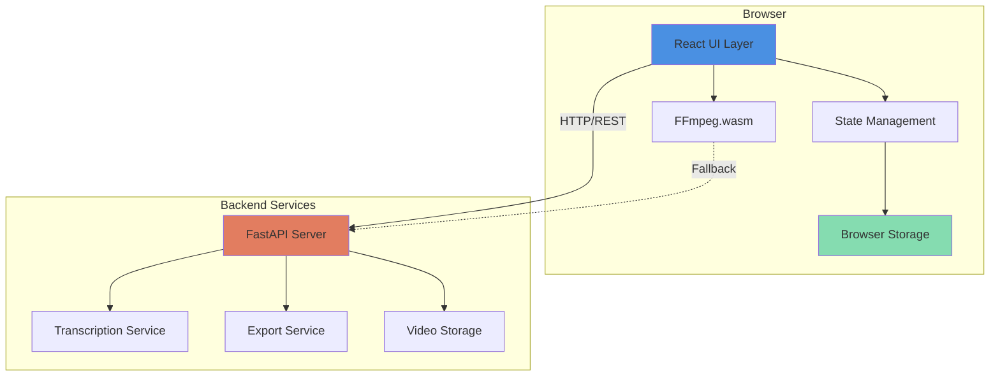
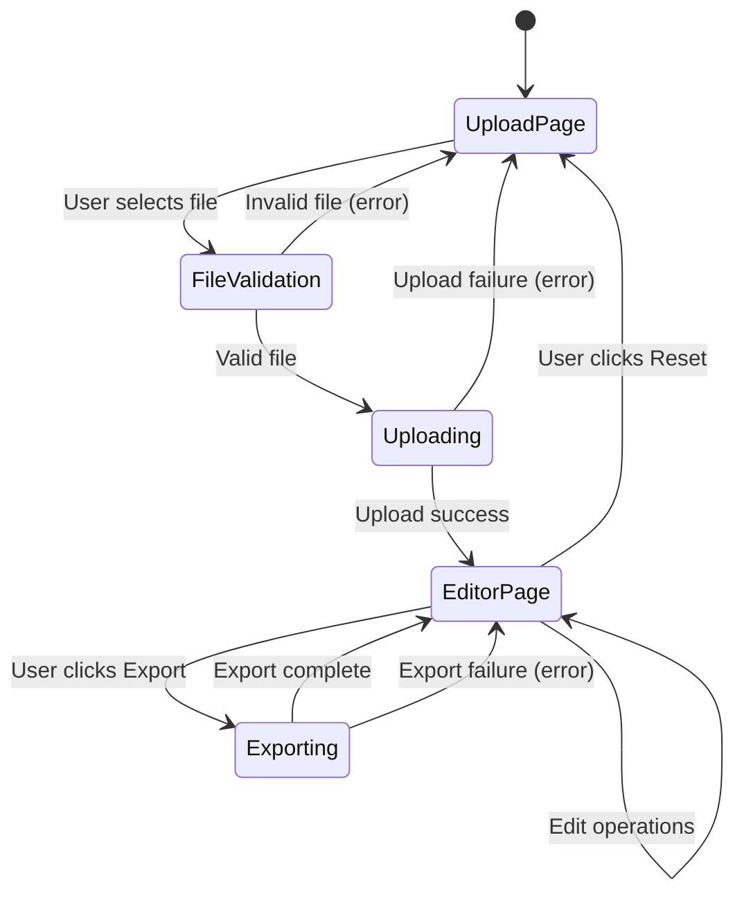
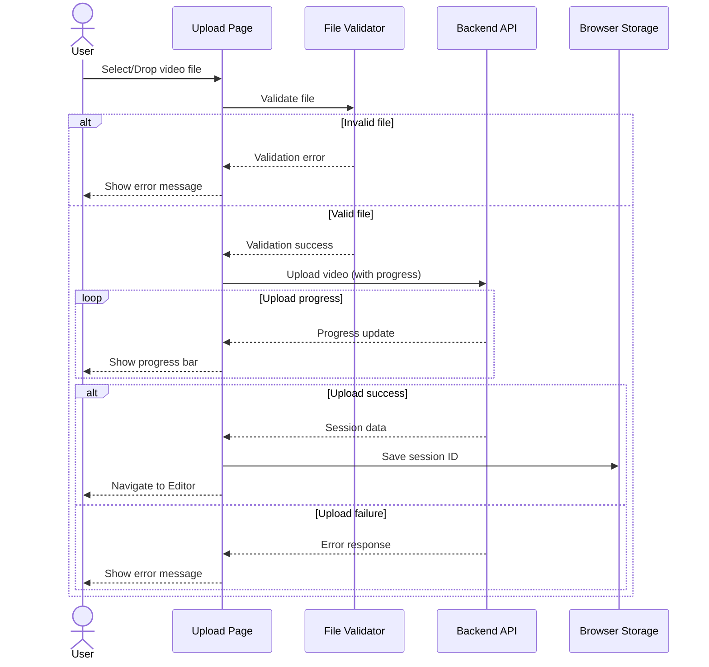
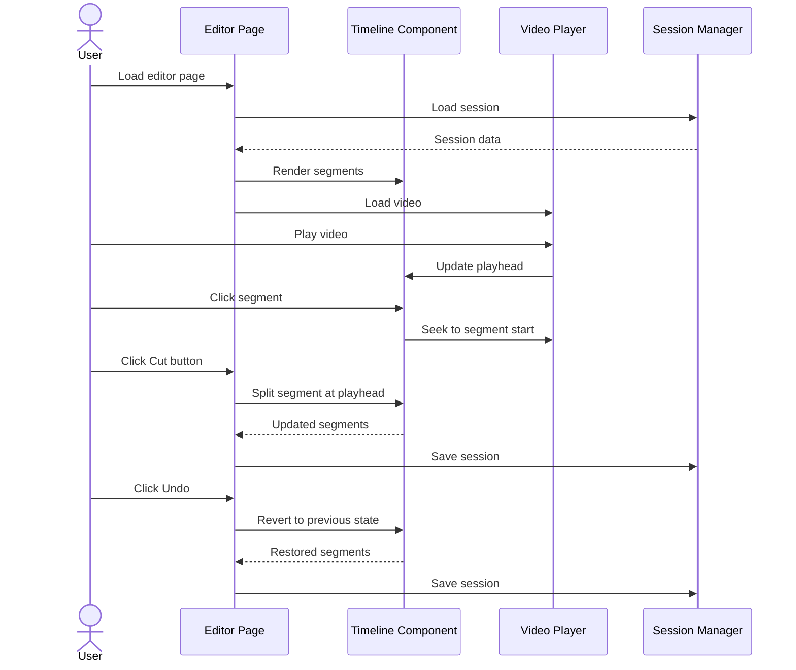
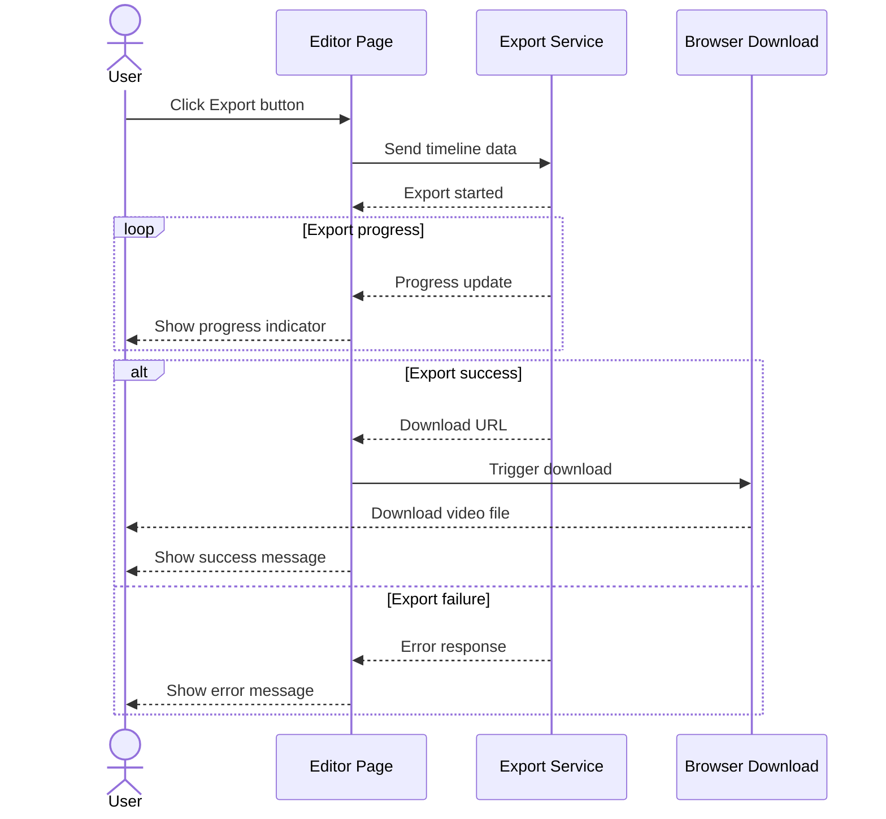
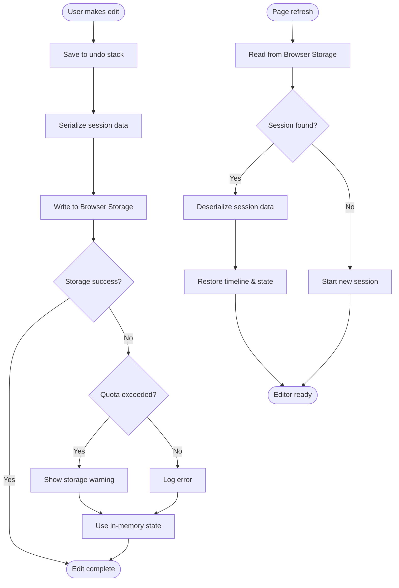

# Design Document: Video Upload and Editor Pages

## Overview

This design document specifies the architecture and implementation approach for the Video Upload Page and Video Editor Page of the AutoEdit AI video editor application. The system provides a web-based interface for uploading videos, transcribing audio content, editing through transcript manipulation, and exporting the final result.

### System Context

AutoEdit is a web-based video editing application built with:
- **Frontend**: React 18+ with modern hooks and functional components
- **Backend**: FastAPI for RESTful API endpoints
- **Video Processing**: FFmpeg.wasm (client-side), MoviePy (server-side)
- **AI Services**: Whisper (local transcription), ChatGPT (transcript modification)
- **Rendering**: Remotion for video composition
- **Storage**: IndexedDB/localStorage for session persistence

### Design Goals

1. **User Experience**: Provide an intuitive, responsive interface for video editing
2. **Performance**: Leverage client-side processing to reduce server load and latency
3. **Reliability**: Implement robust error handling and session persistence
4. **Maintainability**: Use clear component boundaries and state management patterns
5. **Scalability**: Design API contracts that support future feature expansion

## Architecture

### High-Level Architecture



### Component Architecture

The application follows a layered architecture:

1. **Presentation Layer**: React components for UI rendering
2. **State Management Layer**: Redux or Context API for application state
3. **Service Layer**: API clients and business logic
4. **Storage Layer**: Browser storage abstraction
5. **Processing Layer**: Client-side video processing with FFmpeg.wasm

### Page Flow



## Components and Interfaces

### Frontend Components

#### 1. Upload Page Component

**Responsibility**: Handle video file selection and upload initiation

**Props**: None (root component)

**State**:
- `uploadProgress: number` - Upload percentage (0-100)
- `uploadError: string | null` - Error message if upload fails
- `isUploading: boolean` - Upload in progress flag
- `dragActive: boolean` - Drag-over state for visual feedback

**Key Methods**:
- `handleFileSelect(file: File): void` - Validate and initiate upload
- `handleDragOver(event: DragEvent): void` - Handle drag-over visual feedback
- `handleDrop(event: DragEvent): void` - Handle file drop
- `cancelUpload(): void` - Cancel ongoing upload

**Child Components**:
- `DropZone` - Drag-and-drop area with file browser trigger
- `ProgressBar` - Upload progress indicator
- `ErrorMessage` - Error display component

#### 2. Editor Page Component

**Responsibility**: Main editing interface orchestration

**Props**: 
- `sessionId: string` - Unique session identifier

**State**:
- `videoUrl: string` - URL of uploaded video
- `timeline: TimelineSegment[]` - Array of video segments
- `transcript: string | null` - Transcribed text
- `activeTab: 'clips' | 'ai-edit' | 'assets'` - Current sidebar tab
- `selectedSegmentId: string | null` - Currently selected timeline segment
- `undoStack: EditAction[]` - History of editing actions
- `redoStack: EditAction[]` - Undone actions available for redo

**Key Methods**:
- `loadSession(): Promise<void>` - Restore session from storage
- `saveSession(): void` - Persist current state to storage
- `handleExport(): Promise<void>` - Initiate video export
- `handleReset(): void` - Clear session and return to upload

**Child Components**:
- `VideoPlayer` - Video playback component
- `Timeline` - Timeline visualization and interaction
- `Sidebar` - Tabbed editing controls
- `Header` - Session info and action buttons

#### 3. Video Player Component

**Responsibility**: Video playback and control

**Props**:
- `videoUrl: string` - Source video URL
- `currentTime: number` - Playback position in seconds
- `onTimeUpdate: (time: number) => void` - Callback for time changes
- `onSeek: (time: number) => void` - Callback for seek operations

**State**:
- `isPlaying: boolean` - Playback state
- `duration: number` - Total video duration
- `volume: number` - Audio volume (0-1)

**Key Methods**:
- `play(): void` - Start playback
- `pause(): void` - Pause playback
- `seek(time: number): void` - Jump to specific time
- `formatTime(seconds: number): string` - Convert seconds to MM:SS

#### 4. Timeline Component

**Responsibility**: Display and interact with video segments

**Props**:
- `segments: TimelineSegment[]` - Array of video segments
- `currentTime: number` - Current playback position
- `duration: number` - Total video duration
- `onSegmentClick: (segmentId: string) => void` - Segment selection callback
- `onSegmentMove: (segmentId: string, newPosition: number) => void` - Segment reordering

**State**:
- `scrollPosition: number` - Horizontal scroll offset
- `zoom: number` - Timeline zoom level (pixels per second)

**Key Methods**:
- `calculateSegmentPosition(segment: TimelineSegment): { left: number, width: number }` - Convert time to pixels
- `calculateTimeFromPosition(x: number): number` - Convert pixels to time
- `renderPlayhead(): JSX.Element` - Render current position indicator

#### 5. Sidebar Component

**Responsibility**: Tabbed editing controls and tools

**Props**:
- `activeTab: 'clips' | 'ai-edit' | 'assets'` - Current active tab
- `onTabChange: (tab: string) => void` - Tab change callback
- `transcript: string | null` - Transcribed text
- `onTranscriptChange: (text: string) => void` - Transcript edit callback

**State**:
- `isTranscribing: boolean` - Transcription in progress
- `transcriptionProgress: number` - Transcription progress percentage

**Key Methods**:
- `handleTranscribe(): Promise<void>` - Initiate transcription
- `renderTabContent(): JSX.Element` - Render active tab content

### Backend API Endpoints

#### 1. Upload Video

**Endpoint**: `POST /api/videos/upload`

**Request**:
- Content-Type: `multipart/form-data`
- Body: `file: File` - Video file

**Response**:
```typescript
{
  sessionId: string;
  videoUrl: string;
  duration: number;
  resolution: { width: number; height: number };
}
```

**Status Codes**:
- 200: Upload successful
- 400: Invalid file format or resolution
- 413: File too large
- 500: Server error

#### 2. Transcribe Video

**Endpoint**: `POST /api/videos/{sessionId}/transcribe`

**Request**: Empty body

**Response**:
```typescript
{
  transcript: string;
  segments: Array<{
    start: number;
    end: number;
    text: string;
  }>;
}
```

**Status Codes**:
- 200: Transcription successful
- 404: Session not found
- 500: Transcription failed

#### 3. Export Video

**Endpoint**: `POST /api/videos/{sessionId}/export`

**Request**:
```typescript
{
  timeline: TimelineSegment[];
  format: 'mp4' | 'mov' | 'webm';
}
```

**Response**:
```typescript
{
  downloadUrl: string;
  expiresAt: string; // ISO 8601 timestamp
}
```

**Status Codes**:
- 200: Export successful
- 404: Session not found
- 500: Export failed

#### 4. Get Session

**Endpoint**: `GET /api/sessions/{sessionId}`

**Response**:
```typescript
{
  sessionId: string;
  videoUrl: string;
  duration: number;
  createdAt: string;
  lastModified: string;
}
```

**Status Codes**:
- 200: Session found
- 404: Session not found

### Service Layer

#### 1. API Client Service

**Responsibility**: HTTP communication with backend

**Methods**:
- `uploadVideo(file: File, onProgress: (progress: number) => void): Promise<UploadResponse>`
- `transcribeVideo(sessionId: string): Promise<TranscriptResponse>`
- `exportVideo(sessionId: string, timeline: TimelineSegment[]): Promise<ExportResponse>`
- `getSession(sessionId: string): Promise<SessionResponse>`

#### 2. Session Manager Service

**Responsibility**: Browser storage operations

**Methods**:
- `saveSession(sessionId: string, data: SessionData): void`
- `loadSession(sessionId: string): SessionData | null`
- `clearSession(sessionId: string): void`
- `listSessions(): string[]`

**Storage Schema**:
```typescript
interface SessionData {
  sessionId: string;
  videoUrl: string;
  duration: number;
  timeline: TimelineSegment[];
  transcript: string | null;
  undoStack: EditAction[];
  redoStack: EditAction[];
  lastModified: number; // timestamp
}
```

#### 3. File Validator Service

**Responsibility**: Client-side file validation

**Methods**:
- `validateFormat(file: File): ValidationResult`
- `validateResolution(file: File): Promise<ValidationResult>`
- `getSupportedFormats(): string[]`

**Validation Rules**:
- Supported formats: MP4, MOV, WebM
- Minimum resolution: 1280x720 (720p)
- Maximum file size: 2GB

#### 4. FFmpeg Service

**Responsibility**: Client-side video processing

**Methods**:
- `initialize(): Promise<void>` - Load FFmpeg.wasm
- `extractFrame(videoUrl: string, time: number): Promise<Blob>` - Get video frame
- `trimVideo(videoUrl: string, start: number, end: number): Promise<Blob>` - Cut video segment
- `concatenateSegments(segments: VideoSegment[]): Promise<Blob>` - Join segments

## Data Models

### TimelineSegment

Represents a segment of video in the timeline.

```typescript
interface TimelineSegment {
  id: string;              // Unique identifier (UUID)
  sourceStart: number;     // Start time in source video (seconds)
  sourceEnd: number;       // End time in source video (seconds)
  timelineStart: number;   // Start position in timeline (seconds)
  duration: number;        // Segment duration (seconds)
  order: number;           // Sequence order in timeline
}
```

**Invariants**:
- `duration = sourceEnd - sourceStart`
- `duration > 0`
- `sourceStart >= 0`
- `sourceEnd <= video.duration`
- `order >= 0`
- No two segments have the same `order` value

### EditAction

Represents an editing operation for undo/redo functionality.

```typescript
type EditAction = 
  | { type: 'CUT'; segmentId: string; cutTime: number; newSegmentId: string }
  | { type: 'DELETE'; segment: TimelineSegment }
  | { type: 'MOVE'; segmentId: string; oldOrder: number; newOrder: number }
  | { type: 'TRANSCRIPT_EDIT'; oldText: string; newText: string };
```

### SessionData

Complete editing session state.

```typescript
interface SessionData {
  sessionId: string;
  videoUrl: string;
  duration: number;
  resolution: { width: number; height: number };
  timeline: TimelineSegment[];
  transcript: string | null;
  undoStack: EditAction[];
  redoStack: EditAction[];
  lastModified: number;
}
```

### ValidationResult

File validation outcome.

```typescript
interface ValidationResult {
  valid: boolean;
  error?: string;
  details?: {
    format?: string;
    resolution?: { width: number; height: number };
    duration?: number;
  };
}
```

### UploadResponse

Backend response for video upload.

```typescript
interface UploadResponse {
  sessionId: string;
  videoUrl: string;
  duration: number;
  resolution: { width: number; height: number };
}
```

### TranscriptResponse

Backend response for transcription.

```typescript
interface TranscriptResponse {
  transcript: string;
  segments: Array<{
    start: number;
    end: number;
    text: string;
  }>;
}
```

### ExportResponse

Backend response for video export.

```typescript
interface ExportResponse {
  downloadUrl: string;
  expiresAt: string;
}
```


## Correctness Properties

*A property is a characteristic or behavior that should hold true across all valid executions of a system—essentially, a formal statement about what the system should do. Properties serve as the bridge between human-readable specifications and machine-verifiable correctness guarantees.*

This feature includes several areas suitable for property-based testing, particularly around timeline manipulation, undo/redo operations, and session persistence. The following properties formalize the correctness requirements for these core behaviors.

### Property 1: Invalid file format rejection

*For any* file with an extension not in the set {mp4, mov, webm}, the File_Validator SHALL reject the file and return an error message listing the supported formats.

**Validates: Requirements 2.4**

### Property 2: Time formatting correctness

*For any* non-negative time value in seconds, formatting to MM:SS format SHALL produce a string matching the pattern `\d{2}:\d{2}` where the minutes component equals `floor(seconds / 60)` and the seconds component equals `seconds % 60`.

**Validates: Requirements 5.5**

### Property 3: Timeline segment ordering

*For any* array of TimelineSegment objects, when rendered in the Timeline_View, the segments SHALL appear in ascending order by their `order` property from left to right.

**Validates: Requirements 6.2**

### Property 4: Cut operation preserves duration

*For any* TimelineSegment and any cut position `t` where `sourceStart < t < sourceEnd`, splitting the segment at `t` SHALL produce two segments where:
- Segment 1: `sourceStart` to `t`
- Segment 2: `t` to `sourceEnd`
- `segment1.duration + segment2.duration = originalSegment.duration`

**Validates: Requirements 9.5**

### Property 5: Delete operation removes segment

*For any* timeline with `n` segments and any valid segment ID, deleting that segment SHALL result in a timeline with `n-1` segments, and the deleted segment SHALL not be present in the resulting timeline.

**Validates: Requirements 9.6**

### Property 6: Undo reverts action

*For any* valid EditAction and any timeline state, applying the action and then undoing it SHALL restore the timeline to its original state (the state before the action was applied).

**Validates: Requirements 9.7**

### Property 7: Redo reapplies action

*For any* valid EditAction and any timeline state, the sequence (apply action → undo → redo) SHALL result in the same timeline state as (apply action) alone.

**Validates: Requirements 9.8**

### Property 8: New action clears redo stack

*For any* editing state with a non-empty redo stack, performing any new EditAction SHALL result in an empty redo stack.

**Validates: Requirements 9.11**

### Property 9: Session persistence round-trip

*For any* valid SessionData object, saving it to Browser_Storage and then loading it SHALL produce a SessionData object that is deeply equal to the original (all fields match, including nested timeline segments and action stacks).

**Validates: Requirements 10.1**

## Error Handling

### Error Categories

The application handles four primary categories of errors:

1. **Validation Errors**: Client-side validation failures (file format, resolution)
2. **Network Errors**: Communication failures with backend API
3. **Processing Errors**: Video processing failures (transcription, export, FFmpeg)
4. **Storage Errors**: Browser storage quota or access issues

### Error Handling Strategy

#### Validation Errors

**Detection**: Client-side validation before upload
**Response**: 
- Display error message with specific validation failure
- Highlight the problematic input
- Provide guidance on requirements (e.g., "Supported formats: MP4, MOV, WebM")
**Recovery**: User corrects input and retries

**Example**:
```typescript
try {
  const validation = await fileValidator.validateResolution(file);
  if (!validation.valid) {
    showError(`Resolution too low: ${validation.details.resolution.height}p. Minimum 720p required.`);
    return;
  }
} catch (error) {
  showError('Unable to validate video file. Please try again.');
}
```

#### Network Errors

**Detection**: HTTP request failures, timeout, or non-2xx status codes
**Response**:
- Display user-friendly error message
- Distinguish between client errors (4xx) and server errors (5xx)
- For 5xx errors, suggest retry
- For timeout, suggest checking connection
**Recovery**: Automatic retry with exponential backoff (up to 3 attempts)

**Example**:
```typescript
async function uploadWithRetry(file: File, maxRetries = 3): Promise<UploadResponse> {
  for (let attempt = 1; attempt <= maxRetries; attempt++) {
    try {
      return await apiClient.uploadVideo(file);
    } catch (error) {
      if (attempt === maxRetries) throw error;
      if (error.status >= 500) {
        await delay(Math.pow(2, attempt) * 1000); // Exponential backoff
        continue;
      }
      throw error; // Don't retry client errors
    }
  }
}
```

#### Processing Errors

**Detection**: FFmpeg.wasm failures, transcription errors, export failures
**Response**:
- Display error message with operation context
- For FFmpeg failures, automatically fallback to server-side processing
- Log detailed error information for debugging
**Recovery**: 
- FFmpeg: Fallback to backend API
- Transcription: Allow manual retry
- Export: Allow manual retry with option to adjust settings

**Example**:
```typescript
async function processVideo(videoUrl: string): Promise<Blob> {
  try {
    return await ffmpegService.trimVideo(videoUrl, start, end);
  } catch (error) {
    console.error('Client-side processing failed:', error);
    showNotification('Using server-side processing...');
    return await apiClient.processVideo(sessionId, { start, end });
  }
}
```

#### Storage Errors

**Detection**: QuotaExceededError, SecurityError from IndexedDB/localStorage
**Response**:
- Display error message explaining storage limitation
- Suggest clearing old sessions or browser data
- Gracefully degrade to in-memory state (session lost on refresh)
**Recovery**: User clears storage or continues without persistence

**Example**:
```typescript
function saveSession(data: SessionData): void {
  try {
    localStorage.setItem(`session_${data.sessionId}`, JSON.stringify(data));
  } catch (error) {
    if (error.name === 'QuotaExceededError') {
      showError('Storage full. Please clear old sessions or browser data.');
      // Continue with in-memory state
      inMemorySession = data;
    } else {
      console.error('Storage error:', error);
    }
  }
}
```

### Error Message Guidelines

1. **Be Specific**: Explain what went wrong and why
2. **Be Actionable**: Tell users what they can do to fix it
3. **Be Concise**: Keep messages under 100 characters when possible
4. **Be Consistent**: Use the same terminology throughout the application

**Good Examples**:
- ✅ "Video resolution too low (480p). Minimum 720p required."
- ✅ "Upload failed. Check your internet connection and try again."
- ✅ "Export in progress. This may take up to 5 minutes."

**Bad Examples**:
- ❌ "Error: Invalid input"
- ❌ "Something went wrong"
- ❌ "Error code: 422"

### Failure Modes

| Failure Mode | Probability | Impact | Mitigation |
|--------------|-------------|--------|------------|
| Network timeout during upload | Medium | High | Retry with exponential backoff, show progress |
| FFmpeg.wasm initialization failure | Low | Medium | Fallback to server-side processing |
| Browser storage quota exceeded | Low | Low | Degrade to in-memory state, warn user |
| Transcription service unavailable | Low | Medium | Display error, allow retry, continue editing without transcript |
| Export rendering failure | Low | High | Display detailed error, allow retry with different settings |
| Unsupported browser | Medium | High | Detect early, show warning with browser recommendations |

## Testing Strategy

### Testing Approach

The testing strategy employs a multi-layered approach combining unit tests, property-based tests, integration tests, and end-to-end tests.

### Unit Tests

**Purpose**: Verify individual component behavior and edge cases

**Scope**:
- React component rendering and state management
- User interaction handlers (click, drag, input)
- UI state transitions (tab switching, button enabling/disabling)
- Error message display and timing
- Browser API mocking (file input, video element)

**Tools**: Jest, React Testing Library

**Example Test Cases**:
- Upload page renders with correct text and drop zone
- Video player play/pause button toggles correctly
- Timeline segments render in correct order
- Error messages display for minimum 5 seconds
- Undo/Redo buttons disable when stacks are empty
- Reset confirmation dialog appears on button click

### Property-Based Tests

**Purpose**: Verify universal properties across many generated inputs

**Scope**: Core business logic with clear input/output behavior
- File validation logic
- Time formatting functions
- Timeline segment manipulation (cut, delete, reorder)
- Undo/redo stack operations
- Session serialization/deserialization

**Tools**: fast-check (JavaScript property-based testing library)

**Configuration**:
- Minimum 100 iterations per property test
- Each test tagged with format: `Feature: video-upload-and-editor-pages, Property {number}: {property_text}`

**Example Property Tests**:

```typescript
// Property 1: Invalid file format rejection
fc.assert(
  fc.property(
    fc.string().filter(ext => !['mp4', 'mov', 'webm'].includes(ext)),
    (invalidExt) => {
      const result = fileValidator.validateFormat({ name: `video.${invalidExt}` });
      expect(result.valid).toBe(false);
      expect(result.error).toContain('MP4, MOV, WebM');
    }
  ),
  { numRuns: 100 }
);
// Feature: video-upload-and-editor-pages, Property 1: For any file with an extension not in the set {mp4, mov, webm}, the File_Validator SHALL reject the file and return an error message listing the supported formats

// Property 4: Cut operation preserves duration
fc.assert(
  fc.property(
    arbitraryTimelineSegment(),
    fc.double({ min: 0, max: 1 }), // Cut position as fraction
    (segment, cutFraction) => {
      const cutTime = segment.sourceStart + (segment.duration * cutFraction);
      const [seg1, seg2] = cutSegment(segment, cutTime);
      expect(seg1.duration + seg2.duration).toBeCloseTo(segment.duration, 2);
    }
  ),
  { numRuns: 100 }
);
// Feature: video-upload-and-editor-pages, Property 4: For any TimelineSegment and any cut position t where sourceStart < t < sourceEnd, splitting the segment at t SHALL produce two segments where segment1.duration + segment2.duration = originalSegment.duration

// Property 9: Session persistence round-trip
fc.assert(
  fc.property(
    arbitrarySessionData(),
    (sessionData) => {
      sessionManager.saveSession(sessionData.sessionId, sessionData);
      const loaded = sessionManager.loadSession(sessionData.sessionId);
      expect(loaded).toEqual(sessionData);
    }
  ),
  { numRuns: 100 }
);
// Feature: video-upload-and-editor-pages, Property 9: For any valid SessionData object, saving it to Browser_Storage and then loading it SHALL produce a SessionData object that is deeply equal to the original
```

### Integration Tests

**Purpose**: Verify component interactions and API integration

**Scope**:
- Upload flow from file selection to navigation
- Transcription service integration
- Export service integration
- Session restoration on page load
- FFmpeg.wasm fallback to backend API

**Tools**: Jest, MSW (Mock Service Worker) for API mocking

**Example Test Cases**:
- Complete upload flow: select file → validate → upload → navigate to editor
- Transcription flow: click button → API call → display transcript
- Export flow: click button → API call → trigger download
- Session restoration: load page → restore from storage → render timeline
- FFmpeg fallback: client processing fails → API call → success

### End-to-End Tests

**Purpose**: Verify complete user workflows in real browser environment

**Scope**:
- Full editing workflow: upload → transcribe → edit → export
- Session persistence across page refresh
- Error recovery scenarios
- Browser compatibility verification

**Tools**: Playwright or Cypress

**Example Test Cases**:
- User uploads video, makes edits, exports successfully
- User uploads video, refreshes page, session restored
- User uploads invalid file, sees error, uploads valid file
- User performs edit, undo, redo, verifies timeline state

### Test Coverage Goals

- **Unit Tests**: 80% code coverage for components and services
- **Property Tests**: 100% coverage of identified correctness properties
- **Integration Tests**: All API endpoints and service integrations
- **E2E Tests**: Critical user paths (upload, edit, export)

### Continuous Integration

All tests run automatically on:
- Pull request creation
- Commit to main branch
- Nightly builds (including E2E tests)

**CI Pipeline**:
1. Lint and type checking
2. Unit tests (parallel execution)
3. Property-based tests (100 iterations each)
4. Integration tests
5. E2E tests (on staging environment)
6. Coverage report generation

### Test Data Generators

For property-based tests, custom generators create valid test data:

```typescript
// Arbitrary TimelineSegment generator
function arbitraryTimelineSegment(): fc.Arbitrary<TimelineSegment> {
  return fc.record({
    id: fc.uuid(),
    sourceStart: fc.double({ min: 0, max: 3600 }),
    sourceEnd: fc.double({ min: 0, max: 3600 }),
    timelineStart: fc.double({ min: 0, max: 3600 }),
    order: fc.nat()
  }).filter(seg => seg.sourceEnd > seg.sourceStart)
    .map(seg => ({
      ...seg,
      duration: seg.sourceEnd - seg.sourceStart
    }));
}

// Arbitrary SessionData generator
function arbitrarySessionData(): fc.Arbitrary<SessionData> {
  return fc.record({
    sessionId: fc.uuid(),
    videoUrl: fc.webUrl(),
    duration: fc.double({ min: 1, max: 7200 }),
    resolution: fc.record({
      width: fc.integer({ min: 1280, max: 3840 }),
      height: fc.integer({ min: 720, max: 2160 })
    }),
    timeline: fc.array(arbitraryTimelineSegment(), { minLength: 0, maxLength: 50 }),
    transcript: fc.option(fc.string(), { nil: null }),
    undoStack: fc.array(arbitraryEditAction(), { maxLength: 100 }),
    redoStack: fc.array(arbitraryEditAction(), { maxLength: 100 }),
    lastModified: fc.date().map(d => d.getTime())
  });
}
```

## Non-Functional Considerations

### Performance

**Upload Performance**:
- Target: Upload progress updates every 100ms
- Chunked upload for files > 100MB
- Compression before upload (if beneficial)

**Playback Performance**:
- Target: 60 FPS video playback
- Lazy loading of timeline segments
- Virtualized timeline rendering for > 100 segments

**Export Performance**:
- Target: < 5 minutes for 10-minute video
- Progress updates every 5 seconds
- Background processing with Web Workers

### Scalability

**Client-Side**:
- Support videos up to 2GB file size
- Support timelines with up to 500 segments
- Efficient memory management (release video blobs after processing)

**Storage**:
- IndexedDB for large session data (> 5MB)
- localStorage for small metadata (< 5MB)
- Automatic cleanup of sessions older than 30 days

### Security

**Input Validation**:
- File type validation (MIME type + extension)
- File size limits (2GB max)
- Sanitize user input in transcript editing

**API Security**:
- CORS configuration for backend API
- Session token validation
- Rate limiting on upload/export endpoints

**Data Privacy**:
- Videos processed client-side when possible
- Session data stored locally in browser
- No video data persisted on server after export

### Accessibility

**Keyboard Navigation**:
- All controls accessible via keyboard
- Tab order follows logical flow
- Keyboard shortcuts for common actions (Space = play/pause, Ctrl+Z = undo)

**Screen Reader Support**:
- ARIA labels on all interactive elements
- Announce state changes (upload progress, transcription complete)
- Semantic HTML structure

**Visual Accessibility**:
- Minimum contrast ratio 4.5:1 (WCAG AA)
- Focus indicators on all interactive elements
- Support for reduced motion preferences

### Browser Compatibility

**Supported Browsers**:
- Chrome 90+
- Edge 90+
- Firefox 88+ (best effort)
- Safari 14+ (best effort)

**Feature Detection**:
- Detect IndexedDB support
- Detect Web Workers support
- Detect FFmpeg.wasm compatibility
- Graceful degradation for unsupported features

### Monitoring and Observability

**Client-Side Metrics**:
- Upload success/failure rate
- Transcription success/failure rate
- Export success/failure rate
- Average upload time
- Average export time
- FFmpeg.wasm usage vs. fallback rate

**Error Tracking**:
- Log all errors to console with context
- Optional error reporting service integration (e.g., Sentry)
- Track error frequency by type

**User Analytics** (optional):
- Page views and navigation flow
- Feature usage (transcribe, cut, delete, undo/redo)
- Session duration
- Video characteristics (duration, resolution, format)

## Workflow Diagrams

### Upload Workflow



### Edit Workflow



### Export Workflow



### Session Persistence Workflow



## Implementation Notes

### State Management Recommendation

For this feature, **Redux Toolkit** is recommended for state management due to:
- Complex state with undo/redo requirements
- Multiple components needing access to timeline state
- Built-in support for immutable updates
- DevTools for debugging state changes

**Alternative**: React Context API with useReducer for simpler state management if Redux is deemed too heavy.

### Timeline Segment Data Structure

The timeline uses a **flat array** of segments with explicit ordering:

```typescript
// Good: Flat array with order property
timeline: TimelineSegment[] = [
  { id: '1', order: 0, sourceStart: 0, sourceEnd: 10, ... },
  { id: '2', order: 1, sourceStart: 15, sourceEnd: 25, ... },
  { id: '3', order: 2, sourceStart: 30, sourceEnd: 40, ... }
]
```

This approach simplifies:
- Reordering (swap order values)
- Insertion (increment order values)
- Deletion (remove and reindex)
- Serialization (JSON-friendly)

### Undo/Redo Implementation

Use the **Command Pattern** for undo/redo:

```typescript
interface Command {
  execute(): void;
  undo(): void;
}

class CutCommand implements Command {
  constructor(
    private timeline: TimelineSegment[],
    private segmentId: string,
    private cutTime: number
  ) {}
  
  execute(): void {
    // Perform cut operation
  }
  
  undo(): void {
    // Reverse cut operation
  }
}
```

This provides:
- Clear separation of concerns
- Easy testing of individual commands
- Extensibility for new edit operations

### FFmpeg.wasm Integration

Load FFmpeg.wasm lazily on first use:

```typescript
class FFmpegService {
  private ffmpeg: FFmpeg | null = null;
  
  async initialize(): Promise<void> {
    if (this.ffmpeg) return;
    
    this.ffmpeg = createFFmpeg({ log: true });
    await this.ffmpeg.load();
  }
  
  async processVideo(...args): Promise<Blob> {
    await this.initialize();
    // Process video
  }
}
```

This avoids loading the ~30MB FFmpeg.wasm bundle until needed.

### Browser Storage Strategy

Use **IndexedDB** for primary storage with **localStorage** fallback:

```typescript
class SessionManager {
  async saveSession(data: SessionData): Promise<void> {
    try {
      await this.saveToIndexedDB(data);
    } catch (error) {
      console.warn('IndexedDB failed, falling back to localStorage');
      this.saveToLocalStorage(data);
    }
  }
}
```

IndexedDB supports larger data sizes and better performance for complex objects.

### API Client Error Handling

Centralize error handling in the API client:

```typescript
class APIClient {
  private async request<T>(url: string, options: RequestInit): Promise<T> {
    try {
      const response = await fetch(url, options);
      
      if (!response.ok) {
        throw new APIError(response.status, await response.text());
      }
      
      return await response.json();
    } catch (error) {
      if (error instanceof APIError) throw error;
      throw new NetworkError('Connection failed', error);
    }
  }
}
```

This ensures consistent error handling across all API calls.

---

**Document Version**: 1.0  
**Last Updated**: 2024  
**Status**: Ready for Review
